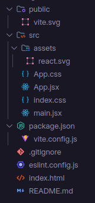
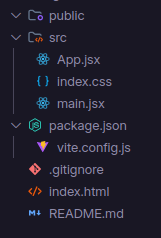
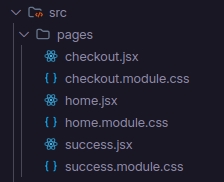

# Coffee Delivery

Nosso novo projeto uitlizando React será uma página para venda de cafés para programadores.

## Vamos iniciar o projeto usando o Vitejs

```bash
npm create vite@latest

- Dê um nome ao projeto: coffee-delivery
- Escolha o framework: React
- Escolha a variante: Javascript
```

Estrutura inicial que o Vite cria pra gente



Vamos dar um limpada no projeto



Dentro do arquivo App.jsx vamos excluir todo o conteúdo e inserir o seguinte código:

```javascript
export function App() {
  return <h1>Hello World</h1>
}
```

Agora no arquivo main.jsx vamos fazer uma pequena alteração:

```javascript
import { StrictMode } from 'react'
import { createRoot } from 'react-dom/client'
import { App } from './App.jsx' // Adicione chaves entre o App
import './index.css'

createRoot(document.getElementById('root')).render(
  <StrictMode>
    <App />
  </StrictMode>,
)
```

Vamos agora no terminal e rodar o comando: 

```bash 
npm install // para instalar as dependências
npm run dev // para rodar a aplicação que estará rodando em http://localhost:5173
```

No arquivo index.css remova todo seu conteúdo para também resetar o css que o vite trás na criação do projeto, adicione o seguinte código:
```css
* {
  margin: 0;
  padding: 0;
  box-sizing: border-box;
}
```

Vamos agora adicionar uma fonte, acesse google fonts, vamos usar a fonte poppins
https://fonts.google.com/specimen/Poppins

No index.html adicione os códigos da fonte, aproveitado vamos em lang é mude para pt-br é em title coloque "Coffee Delivery":

```html
<!doctype html>
<html lang="pt-br">
  <head>
    <meta charset="UTF-8" />
    <link rel="icon" type="image/svg+xml" href="/vite.svg" />
    <meta name="viewport" content="width=device-width, initial-scale=1.0" />

    <!--FONTE GOOGLE-->
    <link rel="preconnect" href="https://fonts.googleapis.com">
    <link rel="preconnect" href="https://fonts.gstatic.com" crossorigin>
    <link href="https://fonts.googleapis.com/css2?family=Poppins:ital,wght@0,100;0,200;0,300;0,400;0,500;0,600;0,700;0,800;0,900;1,100;1,200;1,300;1,400;1,500;1,600;1,700;1,800;1,900&display=swap" rel="stylesheet">
    <!--FONTE GOOGLE-->
    
    <title>Coffee Delivery</title>
  </head>
  <body>
    <div id="root"></div>
    <script type="module" src="/src/main.jsx"></script>
  </body>
</html>
```
### React Router Dom
Neste projeto vamos trabalhar com diferentes páginas. Vamos usar o React Router Dom.

O <strong>React Router DOM</strong> é uma biblioteca usada em aplicações React para gerenciar a navegação entre diferentes páginas sem recarregar a página inteira. Ele permite criar rotas para URLs específicas, associando cada rota a um componente, e facilita a navegação dinâmica dentro do app.

Vamos inciar criando uma pasta `pages` onde vamos criar 3 páginas:

- Home
- Checkout
- Success

Já aproveitando criar os arquivos css de cada página:



No arquivo `home.jsx` iniciar nossa Home

Criar uma pasta dentro de `src` com o nome `components`, dentro de `components` criar dois arquivos `header.jsx` é `footer.jsx`

Vamos instalar o `React Router Dom` :

```bash
npm install react-router-dom
```

Configurando o `React Router Dom`, criar dentro de `src` um arquivo com o nome `routes.jsx` é adicione o seguinte código: 

```javascript
import { Route, Routes } from "react-router-dom";
import { Home } from "./pages/home";
import { Checkout } from "./pages/checkout";
import { Success } from "./pages/success";

export function Router() {
  return (
    <Routes>
      <Route path="/" element={<Home/>}/>
      <Route path="/checkout" element={<Checkout/>}/>
      <Route path="/success" element={<Success/>}/>
    </Routes>
  )
}
```

Agora vamos no arquivo `App.jsx` é vamos alterar algumas coisas:

```javascript
import { BrowserRouter } from "react-router-dom";
import { Router } from "./routes";

export function App() {
  return (
    <BrowserRouter> 
      <Router/>
    </BrowserRouter>
  )
}
```

O `BrowserRouter` é um componente do React Router DOM que envolve toda a aplicação e permite o uso do sistema de rotas baseado no histórico do navegador. Ele usa a API de histórico do navegador (history API) para manter a interface sincronizada com a URL, permitindo a navegação entre as páginas sem recarregar a página inteira.

É chamamos o componente `Router` onde estão nossas rotas para as páginas. Temos as páginas funcionando em nosso projeto.

### Criando um base de dados 

Crie uma pasta com o nome database dentro da pasta `src`. Agora crie um arquivo com o nome `db.jsx` é adicione os seguintes dados: 

```javascript
export const DATABASE = [
  { id: 1, image: "coffee1.svg", title: "Expresso Tradicional", price: 19.99 },
  { id: 2, image: "coffee2.svg", title: "Expresso Americano", price: 19.99 },
  { id: 3, image: "coffee3.svg", title: "Expresso Cremoso", price: 19.99 },
  { id: 4, image: "coffee4.svg", title: "Expresso Gelado", price: 19.99 },
  { id: 5, image: "coffee5.svg", title: "Cafe com Leite", price: 19.99 },
  { id: 6, image: "coffee6.svg", title: "Latte", price: 19.99 },
  { id: 7, image: "coffee7.svg", title: "Capuccino", price: 19.99 },
  { id: 8, image: "coffee8.svg", title: "Macchiato", price: 19.99 },
  { id: 9, image: "coffee9.svg", title: "Mocaccino", price: 19.99 },
  { id: 10, image: "coffee10.svg", title: "Chocolate Quente", price: 19.99 },
  { id: 11, image: "coffee11.svg", title: "Cubano", price: 19.99 },
  { id: 12, image: "coffee12.svg", title: "Havaiano", price: 19.99 },
]
```

Instalar uma biblioteca de ícones:

```bash
npm install lucide-react
```

Agora vamos criar é estilizar nossa página `home`, no arquivo `home.jsx` adicione os seguintes códigos, mas antes criar um componente com o no `card.jsx` onde terá as informações do café, chame esse componente na página home é vamos estilizar o `header.jsx` e `footer.jsx`:


`header.jsx`
```javascript
import styles from './header.module.css'

import { Link } from 'react-router-dom'

import { ShoppingBag } from 'lucide-react'

export function Header() {
  return (
    <header className={styles.header}>
      <Link to='/'>Coffee Delivery</Link>

      <Link to='/checkout'>
        <ShoppingBag size={24} />

        <span>09</span>
      </Link>
    </header>
  )
}
```
`header.module.css`
```css
.header {
  padding: 1.875rem 0 ;

  display: flex;
  align-items: center; 
  justify-content: space-between;

  border-bottom: 1px solid #e6e5e5;

  strong {
    font-size: 1.5rem;
  }

  a {
    display: flex;
    align-items: center;
    gap: 0.5rem;

    text-decoration: none;
    color: #000000;
    font-size: 1.4rem;

    position: relative;

    span {
      position: absolute;
      top: -0.5rem;
      right: -0.5rem;

      width: 1.25rem;
      height: 1.25rem;

      display: flex;
      align-items: center;
      justify-content: center;

      font-size: 0.75rem;
      font-weight: bold;
      color: white;
      background: #DC1637;
      border-radius: 50%;
    }
  }
}
```
`footer.jsx`
```javascript
import styles from './footer.module.css'

export function Footer() {
  return (
    <footer className={styles.footer}>
      <p>© {new Date().getFullYear()} Coffee Delivery. Todos os direitos reservados.</p>
    </footer>
  )
}
```
`footer.module.css`
```css
.footer {
  padding: 1.875rem 0;
    margin-top: 2rem;
  display: flex;
  align-items: center;
  justify-content: center;

  font-size: 0.875rem;
  line-height: 130%;
  color: #8d8686;

  border-top: 1px solid #e6e5e5;
}
```

`card.jsx`

```javascript
import { Plus } from "lucide-react";
import styles from "./card.module.css";

export function Card() {
  return (
    <div className={styles.card}>
      
      <h2>Expresso</h2>
      <strong>R$ 9,90</strong>

      <button>
        <Plus size={20} />
        Adicionar
      </button>
    </div>
  )
}

```
`card.module.css`
```css
.card {
  display: flex;
  flex-direction: column;
  align-items: center;
  justify-content: center;

  padding: 1.25rem;
  gap: 1.25rem;

  width: 16.875rem;
  height: 18.75rem;

  background: #f3f3f3;
  border-radius: 6px 36px;

  img {
    width: 7.5rem;
    height: 7.5rem;
  }

  h2 {
    font-style: normal;
    font-weight: 700;
    font-size: 1.25rem;
    line-height: 130%;
    text-align: center;
    color: #403937;
  }

  strong {
    font-style: normal;
    font-weight: 700;
    font-size: 1.5rem;
    line-height: 130%;
    text-align: center;
    color: #574f4d;
  }

  button {
    display: flex;
    align-items: center;
    justify-content: center;

    padding: 0.5rem;
    gap: 0.5rem;

    width: 7.5rem;

    background: #7789f1;
    border: 0;
    border-radius: 6px;
    color: #ffffff;
    cursor: pointer;
  }
}
```

`home.jsx`
```javascript
import styles from './home.module.css'

import { Header } from '../components/header'
import { Footer } from '../components/footer'
import { Card } from '../components/card'

export function Home() {
  return (
    <div className={styles.container}>
      <Header/>

      <main>
        <h1>Encontre o café ideal para o seu dia</h1>

        <div className={styles.content}>
          <Card/>
          <Card/>
          <Card/>
        </div>

      </main>

      <Footer/>
    </div>
  )
}
```
`home.module.css`
```css
.container {
  max-width: 1000px;
  width: 100%;
  margin: 0 auto;
  padding: 0 1.25rem;

  display: flex;
  flex-direction: column;
  height: 100vh;

  main {
    flex: 1;

    h1 {
      font-size: 1.5rem;
      margin: 1.25rem;
    }
  }

  .content {
    display: grid;
    grid-template-columns: repeat(3, 1fr);
    gap: 1.25rem;
  }
}
```
Temos nosso home estilizado.

Vamos estilizar nossa página de `checkout`:

`checkout.jsx`
```javascript
import { Minus, Plus } from 'lucide-react'
import { Footer } from '../components/footer'
import { Header } from '../components/header'
import styles from './checkout.module.css'

export function Checkout() {
  return (
    <div className={styles.container}>
      <Header/>

      <main>
        <h1>Fazer checkout:</h1>

        <div className={styles.content}>
          <form>
            <input type="text" placeholder='Digite seu nome'/>
            <input type="text" placeholder='Digite seu telefone'/>
            <input type="text" placeholder='Digite seu endereço'/>
            <select name="" id="">
              <option value="">Escolha a forma de pagamento</option>
              <option value="">Cartão de débito</option>
              <option value="">Cartão de crédito</option>
              <option value="">Dinheiro</option>
              <option value="">Pix</option>
            </select>

            <textarea placeholder='Observações:'></textarea>

            <button type='submit'>Confirmar pedido</button>
          </form>

          <div className={styles.cards}>
            <div className={styles.coffee}>
              
              <h2>Expresso</h2>
              <strong>R$ 9,90</strong>
              <div className={styles.quantity}>
                <button>
                  <Plus size={20} />
                </button>
                <span>1</span>
                <button>
                  <Minus size={20} />
                </button>
              </div>
            </div>
          </div>
        </div>

      </main>

      <Footer/>
    </div>
  )
}
```
`checkout.module.css`
```css
.container {
  max-width: 1000px;
  width: 100%;
  margin: 0 auto;
  padding: 0 1.25rem;

  display: flex;
  flex-direction: column;
  height: 100vh;

  main {  
    flex: 1;

    h1 {
      font-size: 1.5rem;
      margin: 1.25rem;
    }
  }

  .content {
    display: grid;
    grid-template-columns: repeat(2, 1fr);
    gap: 1.25rem;

    form {
      display: flex;
      flex-direction: column;
      gap: 1.25rem;

      input {
        padding: 0.75rem;
        border: 1px solid #e6e5e5;
        border-radius: 4px;
      }

      select {
        padding: 0.75rem;
        border: 1px solid #e6e5e5;
        border-radius: 4px;
      }

      textarea {
        padding: 0.75rem;
        border: 1px solid #e6e5e5;
        border-radius: 4px;
      }

      button {
        padding: 0.75rem;
        border: 1px solid #e6e5e5;
        border-radius: 4px;
        background: #e6e5e5;
        cursor: pointer;
      }
    }

    .cards {
      display: flex;
      flex-direction: column;
      gap: 1.25rem;

      .coffee {
        display: flex;
        align-items: center;
        gap: 0.75rem;

        background: #f3f3f3;
        border-radius: 6px 36px;
        padding: 0.75rem;

        img {
          width: 4.5rem;
          height: 4.5rem;
        }

        h2 {
          font-weight: 400;
        }

        strong {
          font-size: 1.25rem;
        }

        .quantity {
          display: flex;
          align-items: center;
          gap: 1rem;

          button {
            width: 1.25rem;
            height: 1.25rem;

            display: flex;
            align-items: center;
            justify-content: center;

            border: none;
            background: #ffffff;
            border-radius: 50%;
            cursor: pointer;
          }
        }
      }
    }
  }
}
```

Vamos estilizar a página de `success.jsx`

`success.jsx`

```javascript
import { Header } from '../components/header'
import styles from './success.module.css'

export function Success() {
  return (
    <div className={styles.container}>
      <Header/>

      <main>
        <h1>Uhu! Pedido confirmado</h1>
        <p>Agora é só aguardar que logo o café chega até você no local que escolheu.</p>

        <div className={styles.content}>
          

          <div className={styles.address}>
            <strong>Endereço de Entrega</strong>
            <p>Av. das Nações Unidas, 1000 Brasil</p>
          </div>
        </div>
      </main>
    </div>
  )
}
```
`success.module.css`
```css
.container {
  max-width: 1000px;
  width: 100%;
  margin: 0 auto;
  padding: 0 1.25rem;

  display: flex;
  flex-direction: column;
  height: 100vh;

  main {
    flex: 1;

    h1 {
      font-size: 1.5rem;
      margin: 1.25rem;
    }
  }

  .content {
    display: flex;
    flex-direction: column;
    align-items: center;

    .address {
      strong {
        font-size: 1.25rem;
      }

      p {
        font-size: 2rem;
      }
    }
  }
}
```

Nossas páginas estão todas estilizadas

Vamos agora deixar funcional nosso delivery.

Listando nossos produtos em tela usando os dados que criamos no `db.jsx` no `home.jsx` vamos usar o `map` para listar todos os produtos é passar as informações via propriedades para o nosso componente `card`

```javascript
import styles from './home.module.css'

import { Header } from '../components/header'
import { Footer } from '../components/footer'
import { Card } from '../components/card'
import { DATABASE } from '../database/db'

export function Home() {
  return (
    <div className={styles.container}>
      <Header/>

      <main>
        <h1>Encontre o café ideal para o seu dia</h1>

        <div className={styles.content}>
          {DATABASE.map(item => (
            <Card
              key={item.id}
              item={item}
              image={item.image}
              title={item.title}
              price={item.price}
            />
          ))}
        </div>

      </main>

      <Footer/>
    </div>
  )
}
```
Agora no componente `card`pegamos via propriedade da seguinte maneira: 
{ id, image, title, price}, depois passamos para as tags html correspondentes.

```javascript
import { Plus } from "lucide-react";
import styles from "./card.module.css";

export function Card({ item, image, title, price}) {
  return (
    <div className={styles.card}>
      
      <h2>{title}</h2>
      <strong>R$ {price}</strong>

      <button>
        <Plus size={20} />
        Adicionar
      </button>
    </div>
  )
}
```
Temos os produtos listado em nosso Home

Agora queremos adicionar um produto em nosso carrinho para que possamos ver nossos produtos na página `checkout`

Vamos aprender um hook muito importante que usamos no dia dia com React, o `use context`

O `useContext` é um hook do React que permite compartilhar dados entre componentes sem precisar passar propriedades manualmente por várias camadas da árvore de componentes. Ele facilita o gerenciamento de estado global, como temas, autenticação de usuários, ou carrinhos de compras, em uma aplicação React.

Configurando o `use context`, crie uma pasta dentro de `src` com o nome `contexts` e um arquivo com o nome `coffee-context.jsx` é adicione o seguinte código:

```javascript
import { createContext } from "react"

export const CoffeeContext = createContext(null)

export function CoffeeContextProvider({ children }) {
  return (
    <CoffeeContext.Provider value={{}}>
      {children}
    </CoffeeContext.Provider>
  )
}
```

Este código cria um contexto chamado CoffeeContext, e o componente CoffeeContextProvider é usado para fornecer esse contexto para todos os componentes filhos. A princípio, o valor do contexto é um objeto vazio ({}), mas você pode adicionar dados ou estados compartilhados dentro desse objeto e, ao redor desse provedor, os componentes filhos terão acesso a esses dados globalmente.

Com esse componente de inicio usando o `createContext` vamos no `App.jsx` é vamos fazer uma pequena alteração.
```javascript
import { BrowserRouter } from "react-router-dom";
import { Router } from "./routes";
import { CoffeeContextProvider } from "./contexts/coffee-context";

export function App() {
  return (
    <CoffeeContextProvider>
      <BrowserRouter>
        <Router/>
      </BrowserRouter>
    </CoffeeContextProvider>
  )
}
```

Importamos o `CoffeeContextProvider` é usamos para que as funções criadas no contexto seja compartilhada em todas as páginas.

Vamos iniciar a função para adicionar um produto no carrinho. No `coffee-context.jsx` vamos fazer a função de adicionar: 
```javascript
import { createContext, useContext, useState } from "react"

export const CoffeeContext = createContext({})

export function CoffeeContextProvider({ children }) {
  const [cart, setCart] = useState([]) // Criamos um estado de array para guardar os items adicionado no carrinho

 // Função que adiciona um item no carrinho
  function addCoffeeTocart(coffee) {
    const existItemToCart = cart.find(item => item.id === coffee.id) // Verificamos se existe um produto no carrinho

    // Se existir fazemos um map no estado cart e atualizamos seu quantity add + 1, se nao existir produto no cart criamos um novo item no cart com a propriedade quantity add 1
    if(existItemToCart) {
      const updateCart = cart.map(item => {
        if( item.id === coffee.id ) {
          return {
            ...item,
            quantity: item.quantity + 1
          }
        }
        return item
      })
      setCart(updateCart)
    } else {
      const newItem = {
        ...coffee,
        quantity: 1
      }
      setCart([...cart, newItem])
    }
  }
  return (
    <CoffeeContext.Provider value={{ // Em value enviamos a funções para usar em qualquer parte do nosso código. Esse função usaremos no componente card e no checkout
      addCoffeeTocart, cart
    }}>
      {children}
    </CoffeeContext.Provider>
  )
}

// Criamos essa função para ficar mais fácil de usar o context 
export function useCoffee() {
  return useContext(CoffeeContext)
}
```

É no componente `card` usaremos a função `addCoffeeTocart` dessa maneira:
```javascript
import { Plus } from "lucide-react";
import styles from "./card.module.css";
import {  useCoffee } from "../contexts/coffee-context";

export function Card({ item, image, title, price}) {
  const { addCoffeeTocart } = useCoffee()  // importamos a função de adicionar um item ao carrinho
  return (
    <div className={styles.card}>
      
      <h2>{title}</h2>
      <strong>R$ {price}</strong>

      <button onClick={() => addCoffeeTocart(item)}> {/* usamos no botão de add a função passando o item */}
        <Plus size={20} />
        Adicionar
      </button>
    </div>
  )
}
```

Vamos mostrar agora o produto adicionado no checkout. Vamos na página `checkout` é vamos buscar o estado `cart` para renderizar os itens em tela do `cart`. Passe o estado `cart` no `value` como fizemos com a função `addCoffeeTocart`.

```javascript
import { Minus, Plus } from 'lucide-react'
import { Footer } from '../components/footer'
import { Header } from '../components/header'
import styles from './checkout.module.css'
import { useCoffee } from '../contexts/coffee-context'

export function Checkout() {
  const { cart } = useCoffee() // importamos o cart onde estão os itens para mostrar no checkout

  return (
    <div className={styles.container}>
      <Header/>

      <main>
        <h1>Fazer checkout:</h1>

        <div className={styles.content}>
          <form>
            <input type="text" placeholder='Digite seu nome'/>
            <input type="text" placeholder='Digite seu telefone'/>
            <input type="text" placeholder='Digite seu endereço'/>
            <select name="" id="">
              <option value="">Escolha a forma de pagamento</option>
              <option value="">Cartão de débito</option>
              <option value="">Cartão de crédito</option>
              <option value="">Dinheiro</option>
              <option value="">Pix</option>
            </select>

            <textarea placeholder='Observações:'></textarea>
            <strong>Total: R$ 9,90</strong>
            <button type='submit'>Confirmar pedido</button>
          </form>

          <div className={styles.cards}> 
          {/* fazemos um map no cart para percorrer o cart */}
            {cart.map(item => ( 
              <div className={styles.coffee}>
              
              <h2>{item.title}</h2>
              <strong>R$ {item.price}</strong>
              <div className={styles.quantity}>
                <button>
                  <Plus size={20} />
                </button>
                <span>{item.quantity}</span>
                <button>
                  <Minus size={20} />
                </button>
              </div>
            </div>
            ))}
          </div>
        </div>

      </main>

      <Footer/>
    </div>
  )
}
```

Acima importamos o `cart` e fizemos um map nele e mostramos os items do carrinho.

Podemos tambem adicionar a função de adicionar item ao carrinho um usar no botão add do carrinho

Criar a função de remover o item do carrinho, abaixo da função de adicionar item ao carrinho:
```javascript
function removerCoffeeFromCart(coffee) {
    const existItemToCart = cart.find(item => item.id === coffee.id) // Vericando se existe item no carrinho

    // Se quantity do item for igual a 1 fazemos um filtro verificando se o id são diferentes ai deletamos o item do carrinho. Mas se quantity for maior que 1 fazemos a lógica de decremento até chegar em 1, dai remove o item
    if(existItemToCart.quantity === 1) {
      const updateCart = cart.filter(item => item.id !== coffee.id)
      setCart(updateCart)
    } else {
      const updateCart = cart.map(item => {
        if( item.id === coffee.id ) {
          return {
            ...item,
            quantity: item.quantity - 1
          }
        }
        return item
      })
      setCart(updateCart)
    }
  }
```

Usar da mesma forma que usamos a função de add no checkout.

Agora vamos fazer a função que soma os items do carrinho é a função de saber a quantidade de itens que tem no carrinho para usar no icone do header.

```javascript
// função que soma os itens no carrinho
const total = cart.reduce((acc, item) => {
    return acc + item.price * item.quantity
  }, 0)

// variavel onde mostrando a quantidade de itens no carrinho
const quantityItemsCart = cart.length

```
Passe essas funções como já usamos e busque nas páginas que precise.


### React Hook Form
O `React Hook Form` é uma biblioteca para gerenciar formulários em aplicações React. Ela facilita a validação, controle de campos e gerenciamento de dados de formulários com uma abordagem baseada em hooks. É conhecida por ser leve, rápida e fácil de usar, além de evitar o re-render excessivo dos componentes.

Vamos configurar o `react hook form` para usarmos de forma eficiente em nossos formulários. 

```bash
// instalando o pacote

npm install react-hook-form
```

Na nossa página `checkout`: 

```javascript
import { Minus, Plus } from "lucide-react";
import { Footer } from "../components/footer";
import { Header } from "../components/header";
import styles from "./checkout.module.css";
import { useCoffee } from "../contexts/coffee-context";
import { useForm } from "react-hook-form";
import { useNavigate } from "react-router-dom";

export function Checkout() {
  const { cart, addCoffeeTocart, removerCoffeeFromCart, total } = useCoffee();

// importamos o useForm, para pegar os dados digitados no input usamos o register, para enviar os dados handleSumit
  const { register, handleSubmit } = useForm();

  const navigate = useNavigate(); // usamos o useNavigate do react router dom para que quando o usuário finalizar o pedido ele vá para a página de sucesso

  // função que pega os dados digitados nos inputs e navega o usuário para a página de sucesso
  function confirmOrder(data) {
    navigate("/success", {
      state: data,
    });
  }

  return (
    <div className={styles.container}>
      <Header />

      <main>
        <h1>Fazer checkout:</h1>

        <div className={styles.content}>
          <form onSubmit={handleSubmit(confirmOrder)}>
            <input
              type="text"
              placeholder="Digite seu nome"
              {...register("name")} // pegamos o que o usuário digita
            />
            <input
              type="text"
              placeholder="Digite seu telefone"
              {...register("phone")}
            />
            <input
              type="text"
              placeholder="Digite seu endereço"
              {...register("address")}
            />
            <select name="" id="" {...register("payment")}>
              <option value="">Escolha a forma de pagamento</option>
              <option value="cartão_débito">Cartão de débito</option>
              <option value="cartão_credito">Cartão de crédito</option>
              <option value="dinheiro">Dinheiro</option>
              <option value="pix">Pix</option>
            </select>

            <textarea
              placeholder="Observações:"
              {...register("obs")}
            ></textarea>
            <strong>Total: R$ {total.toFixed(2)}</strong>
            <button type="submit">Confirmar pedido</button>
          </form>

          <div className={styles.cards}>
            {cart.map((item) => (
              <div className={styles.coffee}>
                
                <h2>{item.title}</h2>
                <strong>R$ {item.price}</strong>
                <div className={styles.quantity}>
                  <button onClick={() => addCoffeeTocart(item)}>
                    <Plus size={20} />
                  </button>
                  <span>{item.quantity}</span>
                  <button onClick={() => removerCoffeeFromCart(item)}>
                    <Minus size={20} />
                  </button>
                </div>
              </div>
            ))}
          </div>
        </div>
      </main>

      <Footer />
    </div>
  );
}

```

Agora na página de sucesso vamos pegar os dados enviados pelo usuário: 

`success.jsx`

```javascript
import { useLocation } from 'react-router-dom'
import { Header } from '../components/header'
import styles from './success.module.css'

export function Success() {
  const { state } = useLocation() // usamos o useLocation do react router dom para buscar o state enviado pelo checkout, depois usamos onde precisamos as informações.

  return (
    <div className={styles.container}>
      <Header/>

      <main>
        <h1>Uhu! Pedido confirmado, {state.name}!</h1>
        <p>Agora é só aguardar que logo o café chega até você no local que escolheu.</p>

        <div className={styles.content}>
          

          <div className={styles.address}>
            <strong>Endereço de Entrega</strong>
            <p>{state.address}</p>
          </div>
        </div>
      </main>
    </div>
  )
}
```

Finalizamos mais um projeto onde usamos React, Vite, Lucide icons, React Router Dom, React Hook Form.

Algums desafios para os alunos:
 - Limpar o carrinho depois de envio do pedido
 - Mostrar uma mensagem na área do carrinho se não existir item
 - Enviar uma mensagem formatada com o pedido para um whatsapp.